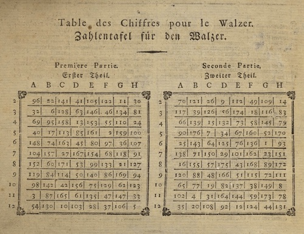
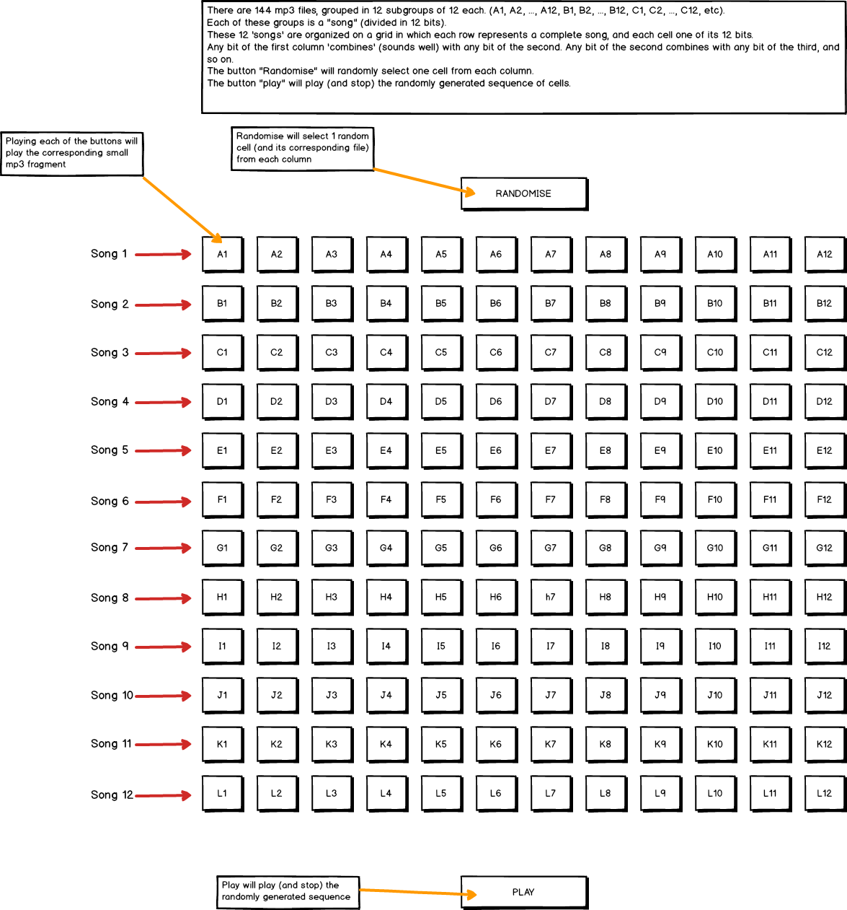

# [**THE MUSICAL DICE**](https://gbrachetta.github.io/Musical-Dice/)

Go [here](https://gbrachetta.github.io/Musical-Dice/) for the live version.

# TABLE OF CONTENTS

1. [**The Idea**](#idea)
   - [**The Original Idea**](#idea)
   - [**My Idea**](#my-idea)
   - [**Target Audience**](#target)

2. [**UX**](#UX)

   - [**User Stories**](#user-stories)
   - [**Design**](#design)
     - [**Framework**](#framework)
     - [**Colour Palette**](#colour-palette)
     - [**Fonts**](#fonts)
     - [**Responsivity**](#responsivity)
   - [**Wireframes**](#wireframes)

3. [**Features**](#features)
   - [**Features in use**](#features)
   - [**To be implemented**](#to-be-implemented)

4. [**Technologies used**](#technologies-used)
   - [**Front-End Technologies**](#front-end-technologies)
   - [**Other Technologies Used**](#other-technologies-used)

5. [**Testing**](#testing)
   - [**Validators**](#validators)
   - [**Manual Tests**](#manual-tests)
   - [**Compatibility**](#compatibility)
   - [**Known Issues**](#known-issues)

6. [**Deployment**](#deployment)
   - [**Local Development**](#local-deployment)
   - [**Live Version**](#remote-deployment)

7. [**Credits**](#credits)
   - [**Content**](#content)
   - [**Media**](#media)
   - [**Code**](#code)
   - [**Acknowledgements**](#acknowledgements)

***

# **THE MUSICAL DICE**

# The Original Idea

## Historical Background

A *Musikalisches Würfelspiel* (German for "musical dice game") was a system that used dice to randomly 'generate' music from precomposed options. These 'games' were quite popular throughout Western Europe in the 18th century. Several different games were devised, some that did not require dice, but merely 'choosing a random number.'

The way these games work may be understood in analogy to sentence construction.

| n   | A         | B      | C       | D          |
| --- | --------- | ------ | ------- | ---------- |
| 1   | The cow   | ran    | past    | the field. |
| 2   | The pig   | walked | through | the yard.  |
| 3   | The sheep | ran    | into    | the marsh. |

A die is rolled for every column and the result of each roll determines which word in that column is used. For example, rolling 2,3,1,3 would give the expression "*The pig ran past the marsh*". Each progression is essentially the same, there may be more or less choices for different slots, and the choices offered for each slot are slight variations rather than being entirely different.

## My Idea

- Fragments are 2 bars long rather than 1.
- All the music was composed by me.

(Selected in blue an example of a possible outcome)

Any end of any of the columns works musically well with the beginning of the following column, so each throw of the dice will create a different piece of music every time (albeit harmonically similar).

## Target Audience

The target audience for this website is music lovers, musicians and people interested in music generation, but it's not limited to those. The app can be enjoyed by casual public as well as it requires no deep understanding of music in order to produce immediate musical feedback. 
***

# UX

This project recreates the old game known in German as *Musikalisches Würfelspiel* in a modern and minimalistic way.

While there are a couple somewhat similar implementations available, this project makes use of Howler.js to deal with media files thus making it ready for the modern web, **including mobile platforms**. These other attempts don't perform well (or at all) on mobile, which accounts for over 54% of the total web traffic.

## User Stories

"As a user, I would like to ____________ "

- have historical information about the origins of the game.
- read clear instructions on how to play the game.
- have clear and quick feedback from the app on clicks by mouse, trackpad and taps.
- have a clear visual understanding of how the randomisation works and what sound is currently playing.
- be able to fully interact with all the buttons without having to go to a different button to stop a sound.
- enjoy the sound of music combined with mathematical functions.
- be surprised and amused by the unexpected musical turns of random music generation.
- understand the logical thinking behind the game.
- be able to hear to all original pieces before fragmented and randomised.
- have the possibility to play each individual fragment in the grid in order to understand how the randomisation works.
- be able to get in touch with the developer by sending him an email.
- easily find ways to follow further projects by the developer.
- be able to get in touch with the developer in different ways.
- be offered an alternative to play the game in case I arrived at the app with Internet Explorer.

## Design

Due to the large quantity of buttons needed to recreate the game, bootstrap has been used to guarantee responsiveness. 
Relative units were used throughout CSS rules to ensure the app would fit all scenarios while staying clearly legible.

### Framework

Bootstrap was my framework of choice due to its felixibility in responsiveness.

### Color Palette

The Color Palette was chosen with complementary hues in mind for contrast and positive visual impact.
It has purposefully been given a modern design to contrast with the aesthetics of the 18th century as this emphasizes the novel approach for the app.

### Fonts

I chose [Montserrat](https://fonts.google.com/specimen/Montserrat) to be the only font in this project because of its excellent legibility in smaller font sizes. This was important where there are space limitations for the text such as in the music grid.
I also didn't want that the choice of a more ornamental font, or multiple fonts, could as a result deviate the attention from the more important elements of the app.

### Responsivity

This website is fully responsive to all sizes and devices. Making the main music grid reactive and legible in small devices was a challenge which was sorted thanks to a combination of factors: Bootstrap's elasticity, clarity of the font family, clear styling highlighting events and discrete use of colors.

## Wireframes

### Page wireframe

### Grid wireframe (detail)

***

# FEATURES

## Features in Use

### Music Player

- The app allows the user to sample the music in different ways, by listening to complete music files, small fragments and (most importantly) random arrays composed from those small fragments.

### Wide selection of options

- From listening to defined MP3 files to letting the user choose which pieces to include or exclude from the game.

### Visual feedback

- The app always gives clear feedback about what is being played and how to interact with it.

### Easy navigation

- Navigation is intuitive, clear and always available. 
- All the content is displayed in a single page and scrolling through the different sections is highlighted by the spy on the navbar.
- On scrolling down, a transparent floating arroy appearing hints the user for a quick shortcut to go back to the top of the page.

## To be implemented

- The possibility for the user to download the resulting randomised piece of music.
- Record the music on an acoustical instrument rather than using midi sounds.
***

# TECHNOLOGIES USED

## Front-end Technologies

-   HTML: Used for markup.
-  CSS: Used to style the elements of the app.
-  Bootstrap: to make use of its grid system and responsiveness.
-  JavaScript: Used for the functionality of the app.
-  jQuery, to access and manipulate the DOM.
-  Howler.js: used to access and deal with all audio elements in an efficient way, ensuring portability on all platforms.
-  email.js: to send emails through my contact form.
-  Font Awesome, for all icons.

## Other Technologies

-  Visual Studio Code: my IDE of choice for all my projects.
-   GitHub: My remote storage for this project.
-  Balsamiq: to create the wireframes of this project.
-  Audacity: to trim, edit and manipulate all music files.

***

# TESTING

## Validators

- [W3C HTML Validator](https://validator.w3.org/)
  - No warnings or errors reported.

- [W3C CSS Validator](https://jigsaw.w3.org/css-validator/)
  - No warnings or errors reported.

- [CSS Lint](http://csslint.net/)
  - No errors found.

- [JSHint](https://jshint.com/)
  - No errors found.

## Manual Tests

Multiple manual tests were performed to ensure the best possible user experience.
This app is fully compatible with all browsers tested except the ones mentioned in the **Compatibility** section, in both desktop and mobile environments.
The following browsers were tested:

- Desktop
  - Chrome (v. 80.0.3987.132)
  - Firefox (v. 73.0.1)
  - Safari (v. 13.0.5)
  - Opera (v. 67.0.3575.53)
- Mobile
  - Safari
  - Chrome
  - Firefox

These were the manual tests performed **and passed**:

- There's never the necessity of pressing the go-back button
- All external links open in a new tab
- Navigation works as expected, without reloading the page
- Pressing any of the music buttons has a purpose, and doing so stops any other or the current sounds, except the buttons of the grid, which have a length of 2 seconds and for which that's unnecessary.
- Scrolling is smooth accross all browsers.
- Modals open and close as expected.
- The floating button works correctly.
- The contact form has required fields (they validate) and works correctly sending emails.
- Sending an email provides the user feedback on email sent. Feedback disappears after a couple seconds.
- Menu (when collapsed) after opening, closes correctly on all browsers when clicking on a link or outside of it.
- Randomisation works smoothly and doesn't crash.
- Repeatedly and quickly pressing the buttons doesn't break the app
- Connections between randomly connected fragments play seamlessly, making the resulting randomised piece play as one mp3 file.
- There are no console errors.
- There's no overflow.
- Menu spy works as expected.
- Navigation never breaks.
- Clicking on the logo brings to the top without reloading the page.
- Using **Internet Explorer** will make a warning appear telling the user to use a different browser for this application, and giving them the correspongind links to download them.
  

## Compatibility

**Internet Explorer is not compatible with the JavaScript used in this app. The issue has been handled by warning Internet Explorer users to choose another browser to ensure compatibility.**

## Known Issues

Besides not performing on Internet Explorer (see above), there are no known issues.

**The method originally used to detect IE browsers can be found [here](https://keithclark.co.uk/articles/moving-ie-specific-css-into-media-blocks/).
Although this method worked perfectly, it made the CSS validator complain.
After further investigation I implemented the current method as described [here](https://paper-leaf.com/blog/2014/09/targeting-ie-10-11-browsers-css/ ) which displays the proper warnings on IE without throwing a validation error (Status: *Solved*).** 

***

# DEPLOYMENT

## Local Development

This project can be ran locally by going to this [Repository link](https://github.com/GBrachetta/Musical-Dice) and clicking on the Clone or Download button and copying the link provided.

In your IDE, open a Terminal window and change to the directory where you want to clone this project and type `Git clone "your copied link"`.

After pressing Enter the project will be created and cloned locally.

Alternatively you can download the zipped file, decompress it and use your IDE of choice to access it.

## Live Version

The live version of this website is hosted on [GitHub Pages](https://gbrachetta.github.io/Musical-Dice/) and will update as new commits occur.

The method used to deploy this website was as follows:

1. In **GitHub**, navigated to my repository.
2. Under my repository, clicked **"Settings"**.
3. Under the **"GitHub Pages"** section, used the Source drop-down menu and selected a publishing source, in this case the Master Branch .
4. The website was immediately published and a green tab appeared with a link to the **live website**.
5. The link obtained is the one displaying at the top of this document.

***

# CREDITS

## Content

- [Mozart Dice Game](https://mozart.vician.cz/) served as trigger and inspiration to build a more dynamic and modern version of the game.
- [Musikalisches Würfelspiel](https://en.wikipedia.org/wiki/Musikalisches_W%C3%BCrfelspiel) (Wikipedia article) was used for historical information about the original game.

## Media

- All the music for this app was composed and edited by me.
- Logo designed after a die by me on Adobe Illustrator.

## Code

This app wouldn't have seen the light without the help of, amongst others:

- [Stack Overflow](https://stackoverflow.com/) #1 place to find answers of all kinds.
- [W3Schools](https://www.w3schools.com/) Another extremelly complete source of information.

All code that helped and was adapted to serve the purposes of this website has been properly marked as such in the comments.

## Acknowledgements

- [Simen Dehlin](https://github.com/Eventyret), mentor and patient counselor.
- [Roko Buljan](https://github.com/rokobuljan), for his invaluable help and sympathy.
- [Tim Nelson](https://github.com/TravelTimN), for great help in several moments of the process.
- [Fran](https://github.com/fdeboo), for proofreading and being there making it all the more enjoyable.

***

#### Back to [top](#top)