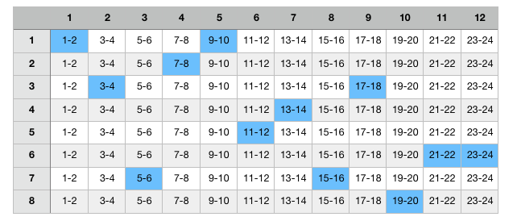

# **THE MUSICAL DICE**

## The Original Idea

### Historical Background

A *Musikalisches Würfelspiel* (German for "musical dice game") was a system for using dice to randomly 'generate' music from precomposed options. These 'games' were quite popular throughout Western Europe in the 18th century. Several different games were devised, some that did not require dice, but merely 'choosing a random number.'

The earliest example is Johann Philipp Kirnberger's Der allezeit fertige Menuetten- und Polonaisencomponist (German for "The Ever-Ready Minuet and Polonaise Composer") (1757 [1st edition; revised 2nd 1783]). Examples by well known composers include C. P. E. Bach's Einfall, einen doppelten Contrapunct in der Octave von sechs Tacten zu machen, ohne die Regeln davon zu wissen (German for "A method for making six bars of double counterpoint at the octave without knowing the rules") (1758) and Maximilian Stadler's Table pour composer des minuets et des Trios à la infinie; avec deux dez à jouer (French for "A table for composing minuets and trios to infinity, by playing with two dice") (1780).

In the early 20th century the Kaleidacousticon System, using arbitrarily combinable playing cards, was unsuccessfully marketed in the Boston area as a parlour game.

### Aesthetics

According to Lawrence Zbikowski:
> "In truth, chance played little part in the success of the music produced by such games. Instead, what was required of the compilers was a little knowledge about how to put the game together and an understanding of the formal design of waltzes, etc."

According to Stephen Hedges:
> "The 'galant' middle class in Europe was playing with mathematics. In this atmosphere of investigation and cataloguing, a systematic device that would seem to make it possible for anyone to write music was practically guaranteed popularity.

The way these games work may be understood in analogy to sentence construction.

| n   | A         | B      | C       | D          |
| --- | --------- | ------ | ------- | ---------- |
| 1   | The cow   | ran    | past    | the field. |
| 2   | The pig   | walked | through | the yard.  |
| 3   | The sheep | ran    | into    | the marsh. |

One rolls one die for each word and selects the word from the appropriate column according to the number. Thus if one rolls 2 3 1 3 one is given, "*The pig ran past the marsh.*" Each progression is essentially the same, there may be more or less choices for different slots, and the choices offered for each slot are slight variations rather than being entirely different.

### Mozart

The most well-known was published in 1792, by Mozart's publisher Nikolaus Simrock in Berlin (K. 294dK3 or K. 516fK6). The game was attributed to Mozart, but this attribution has not been authenticated. The dice rolls randomly selected small sections of music, which would be patched together to create a musical piece. This game is capable of producing 1116 = 45.949.729.863.572.161 different yet similar waltzes.
Some measures have only one possibility no matter what the roll of the dice (measures 8/16) while other measures have a different possibility for each roll (measures 1/16).

Mozart's manuscript, written in 1787, consisting of 176 one-bar fragments of music, appears to be some kind of game or system for constructing music out of two-bar fragments, but contains no instructions and there is no evidence that dice were involved.

The titles of the supposed Mozart compositions are:

- *Anleitung zum Componieren von Walzern so viele man will vermittelst zweier Würfel, ohne etwas von der Musik oder Composition zu verstehen* ("Instructions for the composition of as many waltzes as one desires with two dice, without understanding anything about music or composition")
- *Anleitung zum Componieren von Polonaisen* ("Instructions for the composition of polonaises")

### Other Versions

Robert Xavier Rodríguez composed his Musical Dice Game for string orchestra based on Mozart's K. 516f.

The attribution of Joseph Haydn's *Gioco filarmonico o sia maniera facile per comporre un infinito numero de minuetti e trio anche senza sapere il contrappunto* ("The game of harmony, or an easy method for composing an infinite number of minuet and trios, without any knowledge of counterpoint") has also not been authenticated.

## My Idea

### Ideal Outcome

Ideally my version would have:

- A landing page, containing:
  - Presentation and Historical Background
  - Explanation of the game
- The game page, containing:
  - The game itself, including:
    - A button to randomize the result
    - If possible, the option for the user to freely choose the musical fragments
    - A button to download the resulting MP3 file using an API to merge the selected MP3 fragments (and perhaps some fallback format) **OR**
    - A button to download the resulting MIDI file using an API to merge the selected MIDI fragments.
    - A button to download the resulting music score using an api to merge different PDF files into one file **OR**
    - A button to download the resulting music score using Lilypond as the on-the-fly compiler
- A contact page
  - A form to get in touch and send comments or requests

I plan to make some alterations to the original game and they might include:

- Fragments will be 2 bars long rather than 1
- Music will be composed and performed (in case of managing to use an MP3 merger API) by me as well.

(Selected  in blue an example of a possible outcome)

Any end of any of the columns works well with the beginning of the following column musically, so each throw of the dice will create a different piece of music every time (albeit harmonically similar).

### Loose Ideas and resources to investigate

- [Lilypond](http://lilypond.org/index.html) could be used to dynamically create the score. Lilypond is opensource and compiles a music score by entering text.
- Midi [API](https://www.keithmcmillen.com/blog/making-music-in-the-browser-web-midi-api/) to merge Midi files.
- MP3 merger [API](https://github.com/jackedgson/crunker)
- [Chuck](https://chuck.cs.princeton.edu/), music programming language.
- PDF merger APIs:
  - [Convertapi](https://www.convertapi.com/pdf-to-merge)
  - [Cloudconvert](https://cloudconvert.com/api/v1/mergepdf)
  - [PDFMerge](https://pdfmerge.smartsfile.com/api.html)

### Wireframes (in progress and subject to change)

![Index.html](./wireframes/index.png
